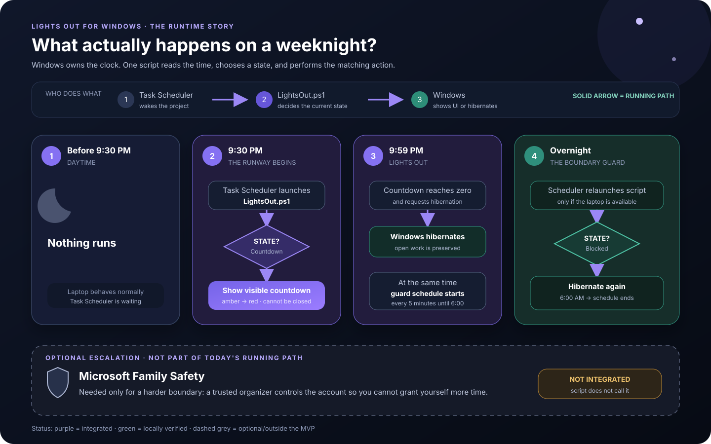

<p align="center">
  
</p>

<h1 align="center">Lights Out for Windows</h1>

<p align="center">
  <strong>A bedtime boundary for adult night owls.</strong>
</p>

<p align="center">
  
  
  
  
</p>

Lights Out gives you time to wrap up, then hibernates your Windows laptop
without closing your work.

## How it works



Windows Task Scheduler wakes the project. `LightsOut.ps1` checks the time, then
either shows the countdown or asks Windows to hibernate. Microsoft Family
Safety is an optional harder boundary; the script does not call it.

The editable [tldraw architecture board](boards/architecture.tldr) remains
available as a technical reference.

## Default schedule

| When | What happens |
| --- | --- |
| Monday-Friday, 11:30 AM | Lunch countdown begins |
| 11:45 AM | Laptop hibernates |
| 1:30 PM | Lunch boundary ends |
| Sunday-Thursday, 9:30 PM | Countdown begins |
| 9:44 PM | Screen turns amber |
| 9:54 PM | Screen turns red |
| 9:59 PM | Laptop hibernates |
| 6:00 AM | Boundary ends |
| Friday-Saturday | Unrestricted |

If the laptop is used during either Lights Out boundary, the boundary guard
hibernates it again within five minutes.

The guard runs only from 11:45 AM to 1:30 PM on weekdays and from 9:59 PM to
6:00 AM on weeknights. It does not poll outside those windows.

## Install

1. Download or clone this repository.
2. Open Windows PowerShell in the project folder.
3. Run:

```powershell
powershell.exe -NoProfile -ExecutionPolicy Bypass -File .\Install-LightsOut.ps1
```

Preview the countdown without hibernating:

```powershell
powershell.exe -NoProfile -ExecutionPolicy Bypass -File .\LightsOut.ps1 -Mode Preview
```

Do not move the project folder after installation. If you move it, run the
installer again from its new location with `-Force`.

## Remove

```powershell
powershell.exe -NoProfile -ExecutionPolicy Bypass -File .\Uninstall-LightsOut.ps1
```

This removes the two scheduled tasks. It does not touch open work or personal
files.

## Enforcement boundaries

Lights Out creates a firm interruption, not an unbreakable lock. An
administrator can disable the scheduled tasks or change the system clock.

For a harder boundary:

1. Use a standard Windows account day to day.
2. Set the same schedule in Microsoft Family Safety.
3. Let someone trusted control the organizer credentials.
4. Keep a separate administrator account for recovery.

## Safety

- Save important work normally; hibernation is not a backup.
- Verify that hibernation works before relying on the schedule.
- Keep disk-encryption recovery information accessible.

Implementation and verification status is tracked in
[ACCEPTANCE.md](ACCEPTANCE.md).

## License

[MIT](LICENSE)
